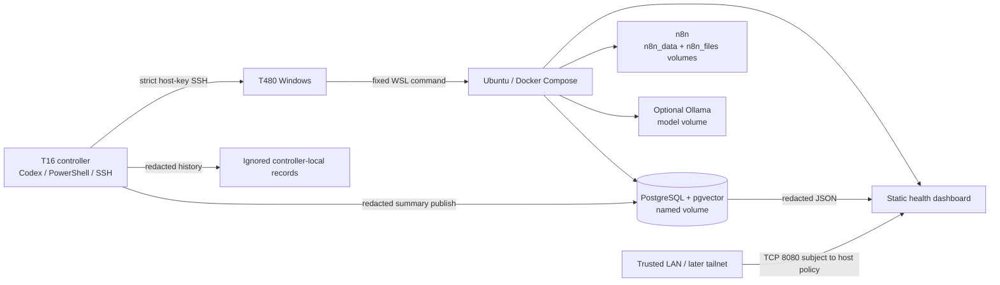

# Repository deep dive

Review completed 2026-09-07 against `main` at `cd4e805fa8eda1b2f8df08b0033b497db970c759` (`feat: add governed Tailscale access controls`). The worktree was one commit ahead of `origin/main` and already contained the untracked review prompt `t480/prompts/repo-deep-dive.md`; this review preserves that work. The review itself adds this document and `docs/repo-improvement-waves.md` only.

## Executive assessment

This is a well-focused, unusually thoughtful local AI-lab platform. Its strongest assets are the constrained remote-operation boundary, pinned runtime inputs, and an evidence-first approach to milestones. The repository is in better shape for deliberate experiments than for unattended operation or disaster recovery: its implemented controls are stronger than its source-of-truth documentation and recovery contract.

The most valuable next action is to make the documented deployment, evidence verifier, and recovery scope agree with the code. In particular, the M2 verifier still requires an obsolete n8n image, PostgreSQL access is described three incompatible ways, and the backup command cannot restore all persistent state required for an n8n-based lab. Those defects can lead an operator to make an incorrect safety or completion decision even while individual scripts pass their narrow checks.

Code quality and operational readiness are distinct here. Local code contracts and syntax checks are healthy; they do not prove current T480 availability, host firewall behavior, boot recovery, dashboard reachability, backup restorability, or the state of the planned Tailscale setup. The local milestone ledger reports M0–M3 proven and M5/M6 in progress, but the ignored raw evidence bundles were deliberately excluded from this review and the ledger is not treated as independent proof.

## Scope, baseline, and validation

### Coverage and exclusions

The review inspected the root runtime configuration; all tracked documentation and operational prompts; PostgreSQL init and migration SQL; monitoring code; all adapters and helper scripts; `t480_core`; catalogs and milestone definitions; workflow JSON; tests; the Tailscale area; and recent Git history relevant to image upgrades and evidence verification. Binary artwork and PDFs were not inspected because they do not affect the platform's execution boundary. Sibling application repositories were not inspected; their documented contracts are treated as unverified external dependencies.

No `AGENTS.md` applies inside this repository. Nearby repositories contain their own instructions and were not used. No remote adapter, T480 service, database, API, image pull, backup/restore drill, firewall, scheduler, or tailnet operation was invoked. Ignored secrets, local evidence bundles, database dumps, and raw operational logs were not read.

### Architecture and trust boundaries

`t480_core` owns transport quoting, SSH enforcement, timeouts, catalog validation, and metadata-only audit logging. `scripts/t480_adapter.py` owns a 91-operation platform and compatibility catalog. PostgreSQL, n8n, Ollama, and dashboard state persist in named Docker volumes; `.env` holds credentials and the n8n encryption key outside Git. Repository settings describe desired bindings, images, and services, but only a live T480 inspection can establish effective Windows firewall rules, Docker/WSL binding behavior, current image IDs, volume state, or external reachability.

### Local validation performed

| Check | Result | Scope and limitation |
| --- | --- | --- |
| `python3 -m pytest -q` | 50 passed | Unit and source-contract tests only; no T480 or Docker runtime reached. |
| `bash -n scripts/*.sh` | passed | Shell syntax only. |
| `python3 -m compileall -q scripts t480_core monitoring tests` | passed | Python parsing only. |
| JSON parsing of tracked `*.json` | 9 files parsed | Syntax only. |
| `node --check monitoring/dashboard/server.js` | passed | JavaScript parsing only. |
| Import adapter and call `validate_contract()` | passed | All 91 adapter operation IDs and approval flags agree with `t480/command-catalog.json`. |
| Markdown link-target check | passed | Local relative links resolve; it does not validate commands or external URLs. |
| `docker compose ... config --quiet` | not run | This WSL environment has no Docker CLI integration. No conclusion about the T480 Compose runtime follows. |

The review did not make current vulnerability, support-lifecycle, or upgrade-compatibility claims from version numbers. Any wave that selects a new image must use current official release notes and advisories at execution time.

### Dimension assessment

| Dimension | Assessment, evidence, and uncertainty |
| --- | --- |
| Purpose and architecture | Strong scope discipline and service/application separation (S-001), but application compatibility work remains in the platform adapter (F-006). Sibling consumers were not inspected. |
| Correctness and maintainability | Transport validation and catalog agreement are strong (S-003), while a stale evidence assertion and no migration state reduce change safety (F-002, F-005). Windows/WSL quoting is locally unit-tested, not live-proven in this review. |
| Security and governance | Fixed allowlists, approval flags, strict host-key checking, and redacted logs are strong (S-003, S-004). Exposure instructions and Healthcheck's data-write semantics need clearer policy (F-001, F-004). Effective firewall and Docker behavior are unknown. |
| Runtime reliability | Compose health checks, named volumes, optional Ollama, and startup design are useful. No-logon recovery remains unproven, dashboard health does not mean fresh lab data, and resource behavior is unmeasured (F-004, F-008). |
| Data and recovery | The isolated PostgreSQL M3 drill is a sound narrow control (S-004), but n8n persistent state, encryption-key recovery, off-host copies, and full-stack restoration are outside it (F-003). |
| Monitoring and evidence | Redacted history and static rendering reduce disclosure risk (S-005), but freshness and intended publishing side effects need an explicit model (F-004). Schedule activation and live data were not inspected. |
| Testing and delivery | 50 fast tests passed locally (S-006), but test tooling/CI are undeclared and no current-image verifier integration test exists (F-002, F-007). Docker Compose could not be resolved in this review environment. |
| Documentation and operations | Runbooks, milestones, and prompts are extensive, but exposure, backup capability, M5 startup principal, and evidence-verifier claims drift (F-001, F-002, F-003). Historical claims are treated as dated statements. |
| Portability and value | Containers, configuration, and a shared transport boundary support future migration; hard-coded compatibility paths and ownership overlap weaken it (F-006). No cloud or sibling-app runtime was assessed. |

## Strengths register

| ID | Strength and evidence | Why it matters / preserve |
| --- | --- | --- |
| S-001 | The root README and learning roadmap consistently keep infrastructure in service of Customer Success AI experiments, and place applications in separate repositories. | This prevents home-lab scope drift. New work should pass the same purpose test and avoid adding services without a concrete workflow need. |
| S-002 | `compose.yaml` pins PostgreSQL, n8n, and Ollama images to tags and immutable digests; `.env.example` defaults PostgreSQL and n8n to loopback. | Repeatable inputs and private-by-default application services are a strong foundation for a small lab. Preserve explicit, reviewed image changes and loopback defaults. |
| S-003 | `t480_core/core.py` validates SSH targets, forces `BatchMode=yes` and `StrictHostKeyChecking=yes`, encodes cross-platform scripts, bounds timeouts, and records hashes instead of remote output. The catalog contract passed locally. | The narrow operation model is the repository's most important control boundary. Do not add free-form shell/PowerShell/SSH arguments or relax host-key checks. |
| S-004 | Mutating adapter operations require `--approve`; the M2/M3 evidence scripts and milestone system distinguish local ledger entries from raw proof. | It separates intention, mutation, and proof. Preserve approval gates and evidence requirements when simplifying future workflows. |
| S-005 | Dashboard rendering escapes content, restricts routes, uses restrictive response headers, and the dashboard container has no database credentials or control routes. | This is a practical least-privilege design for a read-only status surface. Keep the page static and redacted. |
| S-006 | The local suite covers transport validation, catalog agreement, approval flags, dashboard escaping, history retention, migration-path validation, and adapter input handling; all 50 tests passed. | The existing tests make small boundary regressions visible quickly. Expand their behavioral coverage rather than replacing them with a broad rewrite. |

## Findings register

### F-001 — Conflicting exposure policy and a tracked private address

- **Category / priority:** Documentation drift; P1. The impact is mistaken network exposure or reliance on stale connection instructions, likely during setup or recovery.
- **Evidence:** The root README calls PostgreSQL “closed LAN” and also says it is not published to the host ([README.md](/home/chris/projects/cs-ai-lab-infra/README.md:29), [README.md](/home/chris/projects/cs-ai-lab-infra/README.md:34), [README.md](/home/chris/projects/cs-ai-lab-infra/README.md:81)). The architecture says it is on the home LAN ([docs/architecture.md](/home/chris/projects/cs-ai-lab-infra/docs/architecture.md:17)), but the Compose port and environment template default it to `127.0.0.1` ([compose.yaml](/home/chris/projects/cs-ai-lab-infra/compose.yaml:19), [.env.example](/home/chris/projects/cs-ai-lab-infra/.env.example:5)). The PostgreSQL guide tells operators to connect to a tracked private address ([postgres/README.md](/home/chris/projects/cs-ai-lab-infra/postgres/README.md:9)). Milestone guidance forbids recording private addresses in evidence ([t480/milestones.md](/home/chris/projects/cs-ai-lab-infra/t480/milestones.md:44)).
- **Trigger and impact:** A new operator can set a LAN bind to follow the guide, or assume a loopback port has no host exposure. The tracked address also becomes stale after a DHCP or network change and conflicts with the repository's redaction standard.
- **Evidence status / confidence:** Source inspection; high confidence. Effective T480 bindings and firewall behavior are unknown.
- **Mitigations and uncertainty:** Current Compose and `.env.example` choose loopback. The dashboard has a separate Private-profile firewall operation, but a `0.0.0.0` bind alone does not establish which interfaces are reachable.
- **Smallest adequate remedy:** State one source-of-truth exposure table, remove the concrete address, and add a safe configuration assertion for desired binds. Add a separately approved T480/T16 reachability test that records only pass/fail and interface class.

### F-002 — The M2 verifier cannot verify the configured n8n image

- **Category / priority:** Defect / evidence-integrity gap; P1. It can make valid evidence fail or encourage changes that invalidate the current deployment.
- **Evidence:** Compose uses `n8nio/n8n:1.123.76` with its digest ([compose.yaml](/home/chris/projects/cs-ai-lab-infra/compose.yaml:28)), while the M2 verifier requires `1.118.1` ([scripts/verify-m2-evidence.sh](/home/chris/projects/cs-ai-lab-infra/scripts/verify-m2-evidence.sh:26)). M6 explicitly requires correction of this verifier as an acceptance check ([t480/milestone-registry.json](/home/chris/projects/cs-ai-lab-infra/t480/milestone-registry.json:215)). The current local suite does not exercise the verifier against the current Compose image.
- **Trigger and impact:** Re-capturing M2 evidence from the documented current stack fails the verifier despite a healthy current deployment. This makes the verified-evidence chain unreliable during upgrades and recovery.
- **Evidence status / confidence:** Source inspection; high confidence.
- **Mitigations and uncertainty:** The stale verifier may still validate historical 1.118.1 evidence intentionally. That history must be retained or explicitly versioned rather than silently reinterpreted.
- **Smallest adequate remedy:** Version or parameterize the verifier's expected image contract, test it against the checked-in Compose image, and preserve a historical verifier or manifest schema for historical bundles.

### F-003 — Recovery covers a synthetic PostgreSQL database, not the complete lab

- **Category / priority:** Operational gap; P1. A successful M3 drill is valuable but insufficient evidence that n8n can be recovered after loss of the T480 or its volumes.
- **Evidence:** `backup.sh` creates only a PostgreSQL logical dump ([scripts/backup.sh](/home/chris/projects/cs-ai-lab-infra/scripts/backup.sh:16)). Compose persists `n8n_data`, `n8n_files`, and the n8n encryption key is supplied from `.env` ([compose.yaml](/home/chris/projects/cs-ai-lab-infra/compose.yaml:42), [compose.yaml](/home/chris/projects/cs-ai-lab-infra/compose.yaml:55)). The M3 drill intentionally uses isolated synthetic databases, not `POSTGRES_DB` ([scripts/m3-recovery-proof.sh](/home/chris/projects/cs-ai-lab-infra/scripts/m3-recovery-proof.sh:4)); the backup guide recommends off-host copies but provides no mechanism or tested full-stack restore ([docs/backup-restore.md](/home/chris/projects/cs-ai-lab-infra/docs/backup-restore.md:1)).
- **Trigger and impact:** A disk, volume, or host loss can leave workflows, files, credentials required to decrypt n8n data, and configuration unrecoverable despite a valid PostgreSQL dump. An operator may overread “Recovery proven.”
- **Evidence status / confidence:** Source inspection; high confidence. The retained live-state contents and existing backup locations were intentionally not inspected.
- **Mitigations and uncertainty:** The docs correctly describe M3 as a synthetic drill and warn that off-host retention should be strengthened. The postgresql dump is still a sound component of recovery.
- **Smallest adequate remedy:** Define a recovery inventory and recovery point/retention objective, create encrypted or otherwise protected off-host copies for every required recovery artifact, and prove a clean-host synthetic full-stack restoration with explicit handling for the encryption key. Keep customer data out of the drill.

### F-004 — Monitoring has intentional persistence side effects but ambiguous health semantics

- **Category / priority:** Governance and operational-observability gap; P2. It can mislead operators about what a “read-only” command did and whether the dashboard represents current health.
- **Evidence:** `Healthcheck` invokes the service inspection then writes controller history and publishes a PostgreSQL row plus dashboard HTML without an approval flag ([scripts/t480_adapter.py](/home/chris/projects/cs-ai-lab-infra/scripts/t480_adapter.py:1668), [scripts/t480_adapter.py](/home/chris/projects/cs-ai-lab-infra/scripts/t480_adapter.py:1700)). Operations documentation accurately notes publication, yet also describes the monitoring boundary in service-mutation terms ([docs/operations.md](/home/chris/projects/cs-ai-lab-infra/docs/operations.md:9), [docs/operations.md](/home/chris/projects/cs-ai-lab-infra/docs/operations.md:23)). The dashboard `/healthz` always reports OK when the server runs, including before any result is published ([monitoring/dashboard/server.js](/home/chris/projects/cs-ai-lab-infra/monitoring/dashboard/server.js:10)), and the dashboard intentionally serves stale data ([monitoring/README.md](/home/chris/projects/cs-ai-lab-infra/monitoring/README.md:5)). The scheduler is disabled ([monitoring/healthcheck-schedule.json](/home/chris/projects/cs-ai-lab-infra/monitoring/healthcheck-schedule.json:3)).
- **Trigger and impact:** A caller following a generic “read-only” label can create records and render files. A green container health check says the HTTP server is alive, not that T480 health data is fresh or that a control-path check succeeded.
- **Evidence status / confidence:** Source inspection; high confidence.
- **Mitigations and uncertainty:** It never starts, restarts, or exposes services; only redacted output is persisted. Stale serving is documented as intentional. The required freshness threshold and desired scheduling model are product decisions.
- **Smallest adequate remedy:** Name health publication as a side effect in the contract and audit output; distinguish server availability, last successful observation, and stale/unknown data in the dashboard; add a freshness policy before enabling a scheduler or notification.

### F-005 — Migration execution has no recorded applied-version state

- **Category / priority:** Maintainability and recovery gap; P2.
- **Evidence:** Fresh volumes run init wrappers that include the migration files ([compose.yaml](/home/chris/projects/cs-ai-lab-infra/compose.yaml:14), [postgres/init/002-health-dashboard.sql](/home/chris/projects/cs-ai-lab-infra/postgres/init/002-health-dashboard.sql:1)). Existing databases apply a selected file through an adapter, but no migration ledger or checksum table is present in the SQL or adapter ([scripts/postgres_pgvector_adapter.py](/home/chris/projects/cs-ai-lab-infra/scripts/postgres_pgvector_adapter.py:91)). Current statements are largely idempotent, but no transaction or version record proves which revision has been applied.
- **Trigger and impact:** A future non-idempotent schema change can be partially applied or skipped inconsistently across a fresh volume, existing T480 database, and restored database. Operators must infer state from files and output.
- **Evidence status / confidence:** Source inspection; high confidence.
- **Mitigations and uncertainty:** The existing two monitoring migrations use `IF NOT EXISTS` and `CREATE OR REPLACE`, reducing current risk. There is no evidence of an existing failure.
- **Smallest adequate remedy:** Adopt a minimal, repository-owned migration ledger with checksums and transactional application where PostgreSQL supports it; test fresh, upgrade, rerun, and failed migration behavior before adding product schemas.

### F-006 — Platform adapter retains broad application-specific compatibility work

- **Category / priority:** Maintainability and ownership gap; P2.
- **Evidence:** The main adapter is 1,975 lines with 91 operations, including 12 transcription, 4 Forex, and 13 security operations. The architecture says applications belong in their own repositories ([docs/architecture.md](/home/chris/projects/cs-ai-lab-infra/docs/architecture.md:3)); the migration note says transcription mutations remain temporarily in this repository pending real proof ([docs/t480-adapter-migration.md](/home/chris/projects/cs-ai-lab-infra/docs/t480-adapter-migration.md:42)).
- **Trigger and impact:** A platform change now has a wide catalog and a large test surface. Application-specific deployment, media, and finance work can delay or complicate core lab maintenance, while an incomplete migration leaves unclear ownership.
- **Evidence status / confidence:** Source inspection; high confidence.
- **Mitigations and uncertainty:** Retaining compatibility operations is an explicitly documented safety decision until their replacement is proven. There is no basis to remove them immediately.
- **Smallest adequate remedy:** Establish an ownership/deprecation register and move one proven application operation family at a time with contract tests, a real evidence gate, rollback, and a removal date only after consumer proof.

### F-007 — Local tests are not reproducibly declared or continuously run

- **Category / priority:** Delivery gap; P2.
- **Evidence:** The project metadata declares setuptools and pytest configuration but no test dependency group, lint configuration, task runner, or CI workflow ([pyproject.toml](/home/chris/projects/cs-ai-lab-infra/pyproject.toml:1)); no tracked CI or dependency-management files exist. The 50 local tests passed only because this review environment already has pytest. Several useful tests assert source strings and operation dictionary contents, which do not validate the corresponding script behavior on Windows/WSL/Docker.
- **Trigger and impact:** A fresh contributor or release environment cannot reproduce the documented validation with one declared install command. A passing suite may miss quoting, Compose, migration, or image-contract regressions.
- **Evidence status / confidence:** Observed locally and source inspection; high confidence.
- **Mitigations and uncertainty:** The package itself uses the standard library; tests are fast and meaningful for many boundary controls. Actual CI provider choice is open.
- **Smallest adequate remedy:** Declare a development/test environment, add a small local quality command and CI that runs it, then add contract tests for Compose image/verifier alignment, migration paths, and payloads. Keep real-machine drills separate.

### F-008 — Runtime resource and dashboard-image coupling are deferred risks

- **Category / priority:** Enhancement / P3. Address after evidence integrity and recovery rather than adding infrastructure preemptively.
- **Evidence:** The T480 is documented as a 16 GB CPU-only machine, while Compose has no resource reservations or limits. The dashboard executes a custom Node server using the n8n image, so each n8n upgrade changes both workflow and dashboard runtime ([compose.yaml](/home/chris/projects/cs-ai-lab-infra/compose.yaml:76)).
- **Trigger and impact:** A model pull or workflow spike can compete with PostgreSQL/n8n; a dashboard regression can be introduced by an otherwise justified n8n upgrade.
- **Evidence status /confidence:** Source inspection; medium confidence. No real capacity or fault-injection evidence was available.
- **Mitigations and uncertainty:** Ollama is optional and health checks report basic disk/memory warnings. The one-image dashboard is operationally simple today.
- **Smallest adequate remedy:** Measure actual baseline and peak use first. If evidence warrants it, set modest resource guardrails and replace the dashboard runtime only with a smaller pinned image plus equal health/header tests.

### F-009 — The planned Tailscale workflow lacks a usable reviewed policy example

- **Category / priority:** Documentation and readiness gap; P3 until M10 execution begins.
- **Evidence:** The Tailscale template exists under `tailscale/`, and the README link resolves, but the documented commands name `tailscale/policies/reviewed-policy.hujson` while the tracked policy directory contains only `.gitkeep` ([tailscale/README.md](/home/chris/projects/cs-ai-lab-infra/tailscale/README.md:22)).
- **Trigger and impact:** An operator reaches the approved-policy step without a reviewable least-privilege starting artifact, increasing the chance of composing policy ad hoc during a live access change.
- **Evidence status / confidence:** Source inspection; high confidence.
- **Mitigations and uncertainty:** M10 is explicitly planned and requires separate approval; no tailnet change is implied.
- **Smallest adequate remedy:** Add a commented deny-by-default policy template and offline validation fixture before M10, but do not populate device identifiers or apply it automatically.

## Documentation and milestone reconciliation

| Topic | Conflicting or incomplete claim | Reconciliation required |
| --- | --- | --- |
| PostgreSQL exposure | README/architecture/PostgreSQL guide describe LAN access, host non-publication, and a concrete LAN endpoint; current template defaults loopback. | Make loopback the documented v1 baseline; define any future LAN exception and its approval/evidence requirements. |
| M2 evidence | M6 says verifier integrity has been corrected; verifier still expects `1.118.1`. | Do not mark M6's `validation_integrity_corrected` check passed until the verifier and a test agree with current Compose. |
| Backup capability | `backup.sh` and M3 implement PostgreSQL backup/recovery, while `next-session.md` says no backup capability exists for M8 planning. | Say “no proven full-platform backup freshness/restore control,” not “no backup capability.” Preserve M3's narrower proof. |
| Healthcheck safety | M8 says monitoring never mutates a T480 service; `Healthcheck` writes redacted database rows and static output. | Retain the no-service-control guarantee, but label persistence/publication as intended data side effects. |
| M5 startup | M5 registry expects boot-triggered passwordless S4U; setup prose labels this a Local System task in one place, while adapter source uses an S4U user principal. | Resolve the implementation target before live M5 changes and make prompt, registry, source, and acceptance evidence match. |

No milestone is marked proven by this review. M0–M3 ledger state and M5/M6 progress were observed only as local status summaries, not revalidated against raw evidence.

## Preserve and defer

Keep Docker Compose rather than introducing Kubernetes; fixed operation IDs rather than a remote shell; isolated synthetic recovery proof; loopback n8n and PostgreSQL defaults; optional Ollama; static dashboard rendering; image digest pinning; and separate application repositories.

Defer public ingress, alerting destinations, automatic remediation, router changes, tailnet enrollment, external backup tooling selection, a dashboard-runtime replacement, and resource limits until the relevant wave supplies a concrete need and evidence. No credible P0 issue was established from repository inspection alone.
